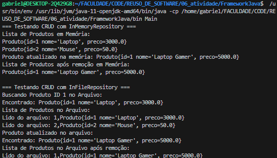

# 📌 Framework Simples em Java

Este projeto é um **framework simples** para gerenciar entidades genéricas em Java, implementando operações básicas de **CRUD** (Create, Read, Update, Delete) usando duas abordagens de armazenamento: **em memória** e **em arquivo**.

---

## 🚀 Funcionalidades

✅ Implementação genérica para CRUD usando `Generics`  
✅ Armazenamento dos dados **em memória** (`InMemoryRepository`)  
✅ Armazenamento dos dados **em arquivo** (`InFileRepository`)  
✅ Suporte a múltiplas entidades, como `Produto`  
✅ Código modular e reutilizável  

---

## ⚙️ Como Compilar e Executar

### 1️⃣ **Entrar na pasta do projeto**

```bash
cd FrameworkJava
```

### 2️⃣ **Executar .jar**

```bash
java -jar meu_framework.jar
```

---

## 📝 Output gerado

